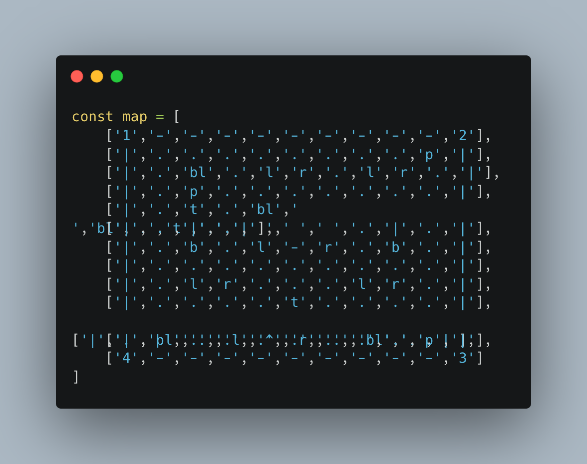
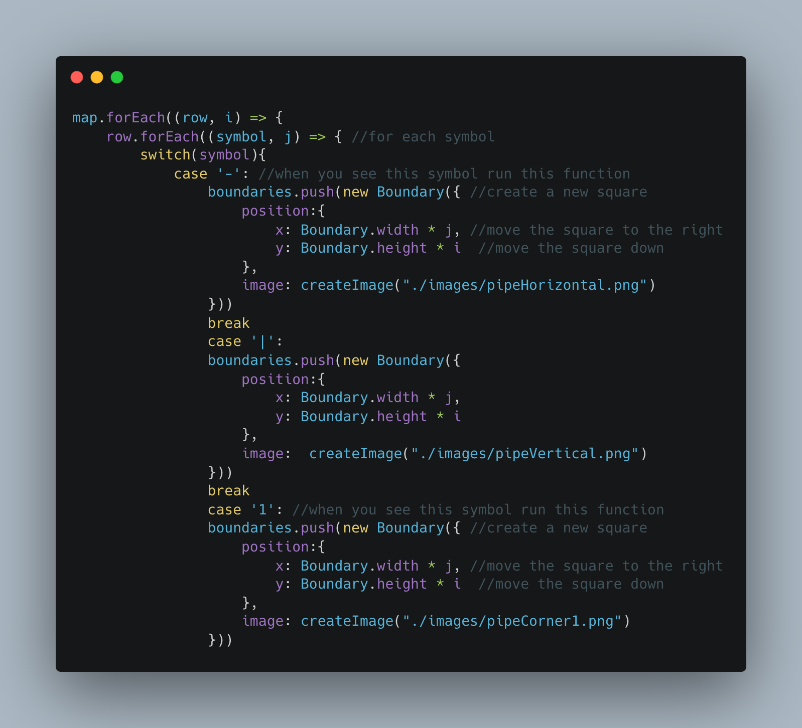
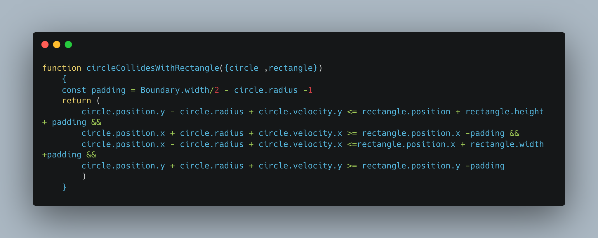
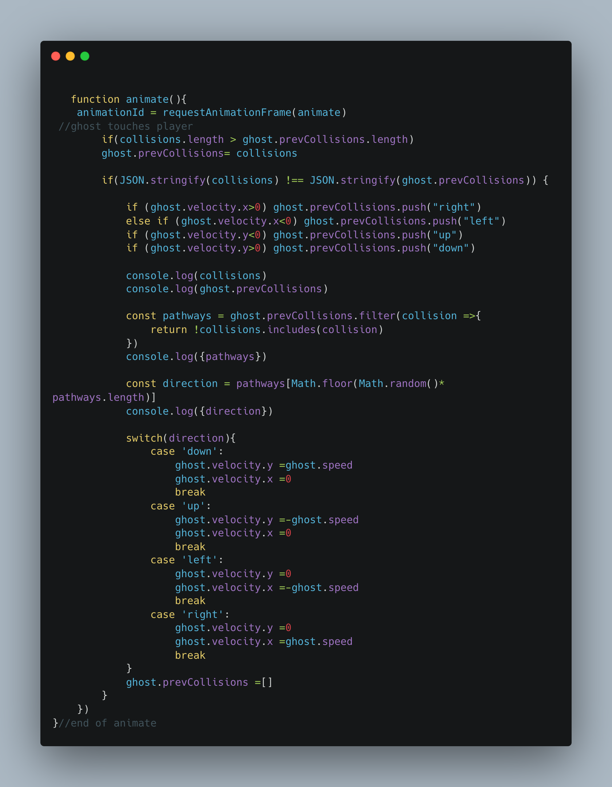

# **PAC-MAN :yellow_circle:**

## Pac-Man is a maze action video game. :joystick:

This project is an example that was built following a Youtube content creator, name Chris. This project allowed me to further explore the following topics:

1. Object Oriented Programming 
2. Collision Detection 
3. For loops 
4. Arrays 
5. HTML 5 Canvas

## Watch Chris's Youtube Video 
Chris Course Youtube: https://www.youtube.com/watch?v=5IMXpp3rohQ&list=RDCMUC9Yp2yz6-pwhQuPlIDV_mjA&start_radio=1&rv=5IMXpp3rohQ&t=18

## User Instructions 

We all know and love Pac-Man, but here are the basics.

- :yellow_circle: moves around the screen
using the up, down, left, and right arrow keys.
- :yellow_circle: must avoid the other :ghost:  aka other color circles!
- :yellow_circle:  can eat the PowerPellets (4) to scare the ghost for 5 seconds. :yellow_circle:  removes the :ghost:  when they eat them. (see 'show must continue for a challenge)
- To win the game the :yellow_circle: must eat all the pellets before and not collide with the ghost. If you do... you lose. 

## Developer's Corner :notebook:    

Chris's video helps me build a skeleton to expand on and taught me some new skills along the way. See some of the code blocks, below that I found to be difficult. 

## Classes

---

## Grid

---

## Collision Detect :ghost:

 

## And the show must continue ... A test to myself and others 

- :pushpin: Use sprite to create characters and Pacman grid
- :pushpin: Have ghost respawn in a caged area
- :pushpin: Have ghost chase pacman 
- :pushpin: Ghost shows a scared face when blue (using sprite)
- :pushpin: Have a next level options 
- :pushpin: Have ghost velocity increase with each level 
- :pushpin: Have Pac-Man animation when the game over 
- :pushpin: Append high score 

## Resources :scroll:   
- [Spread Syntax](https://developer.mozilla.org/en-US/docs/Web/JavaScript/Reference/Operators/Spread_syntax)
- [Switch Case Conditional](https://www.w3schools.com/js/js_switch.asp)
- [Canvas](https://developer.mozilla.org/en-US/docs/Web/API/Canvas_API)
- [Circular Motion](https://www.youtube.com/watch?v=raXW5J1Te7Y&t=288s)
- [How to Detect Rectangle Collision](https://www.youtube.com/watch?v=_MyPLZSGS3s&t=395s)
- [Sprite for PacMan](https://spritedatabase.net/file/15069)

### Read me resources :scroll:  
- [Markdown CheatSheet](https://github.com/adam-p/markdown-here/wiki/Markdown-Cheatsheet)
- [Three ways to add images to your Readme](https://www.seancdavis.com/posts/three-ways-to-add-image-to-github-readme/)
- [Carbon](https://carbon.now.sh/?bg=rgba%28171%2C+184%2C+195%2C+1%29&t=seti&wt=none&l=auto&width=680&ds=true&dsyoff=20px&dsblur=68px&wc=true&wa=true&pv=56px&ph=56px&ln=false&fl=1&fm=Hack&fs=14px&lh=133%25&si=false&es=2x&wm=false&code=)
- [GitHub Emoji's](https://github.com/ikatyang/emoji-cheat-sheet/blob/master/README.md)

## Contributions:

**:fire:Third Degree Burns:fire:**: free therapists!! :heart:

- General Assembly's Instructional Team :clap:  
- [Chris Course on Youtube]: (https://www.youtube.com/c/ChrisCourses) :clap: 

