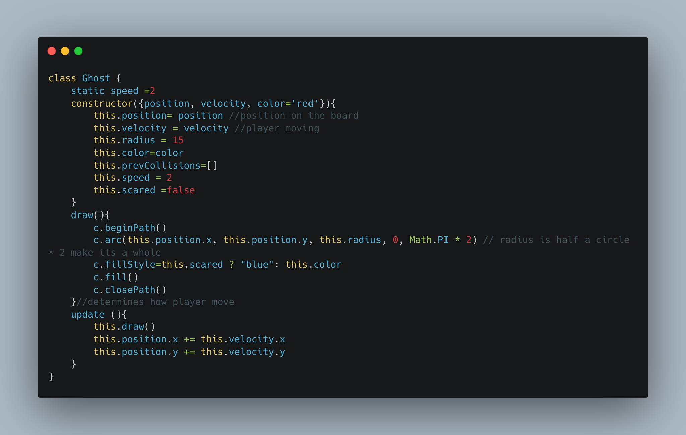

# **PAC-MAN**

## Pac-Man is a maze action video game. 

This project is an example that was built following along with a Youtube content creator, name Chris. This project help provide detailed explaintion on how to do the following: 

1.Object Oriented Programming 
2.Collision Detection 
3.For loops 
4.Arrays 
5.HTML 5 Canvas

## Watch Chris's Youtube Video 
Chris Course Youtube: https://www.youtube.com/watch?v=5IMXpp3rohQ&list=RDCMUC9Yp2yz6-pwhQuPlIDV_mjA&start_radio=1&rv=5IMXpp3rohQ&t=18

## User Instructions 

We all know and love Pac-Man, but here are the basic.

-Player moves the yellow circle around the screen
using the up, down, left, and right arrow key.
-Player must avoid the other color circle aka ghost!
-If player eats the powerPellet (4) the ghost will turn blue for 5 second. The player can eat and remove the ghost from the game (under construction, indiviudal goal)
-To win the game the player must eat all the pellets before and not collide with the ghost. If you do... you lose. 

## Developer's Corner

It is my own opionion that Chris's video help you build a skeleton, but leaves you room to turn this into your own, once you develop a understanding. See some of the code block I found to be diffcult, but developed a deeper understanding using Chris video. 

## And the show must continue ... A test to myself and others 

-Use sprite to create characters and pacman grid
-Have ghost respawn in a cage area
-Have ghost chase pacman 
-Ghost shows scared face when blue (using sprite)
-Have a next level options 
-Have ghost velocity increase with each level 
-Have Pac-Man animation when game over 
-Append high score 

## Resources 
-Spread Syntax: https://developer.mozilla.org/en-US/docs/Web/JavaScript/Reference/Operators/Spread_syntax
-Switch Case Conditional: https://www.w3schools.com/js/js_switch.asp
-Canvas: https://developer.mozilla.org/en-US/docs/Web/API/Canvas_API
-Circular Motion: https://www.youtube.com/watch?v=raXW5J1Te7Y&t=288s
-How to Detect Rectangle Collision: https://www.youtube.com/watch?v=_MyPLZSGS3s&t=395s
-Sprite for PacMan: https://spritedatabase.net/file/15069

### Read me resources 
-Markdown CheatSheet: https://www.markdownguide.org/cheat-sheet/
-Three ways to add images to your Readme: https://www.seancdavis.com/posts/three-ways-to-add-image-to-github-readme/
-Carbon: https://carbon.now.sh/?bg=rgba%28171%2C+184%2C+195%2C+1%29&t=seti&wt=none&l=auto&width=680&ds=true&dsyoff=20px&dsblur=68px&wc=true&wa=true&pv=56px&ph=56px&ln=false&fl=1&fm=Hack&fs=14px&lh=133%25&si=false&es=2x&wm=false&code=

## Contributions:

**Third Degree Burns**: free threapists!!
General Assembly's Instructional Team 
Chris Course on Youtube : https://www.youtube.com/c/ChrisCourses

